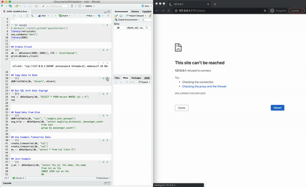

##  Dask or RAPIDS SQL (DORS)



## Usage

```R
library(DORS)
db <- dbConnect(DORS::DORS(), CTX = 'distributed')
dbWriteTable(db, "mtcars", mtcars)
res <- dbGetQuery(db, "SELECT * FROM mtcars WHERE cyl > 4")
```

## Setup

### Dask/R

> mamba create -n dors -c conda-forge r-reticulate r-dbi r-dplyr r-devtools \
>     dask distributed dask-sql python=3.8 pyarrow

### BlazingSQL/RAPIDS/DASK/R

> mamba create dors -c blazingsql/label/cuda11.0 -c blazingsql -c rapidsai -c nvidia -c conda-forge \
>   blazingsql r-reticulate r-dbi r-dplyr r-devtools dask distributed dask-sql pyarrow python=3.8


